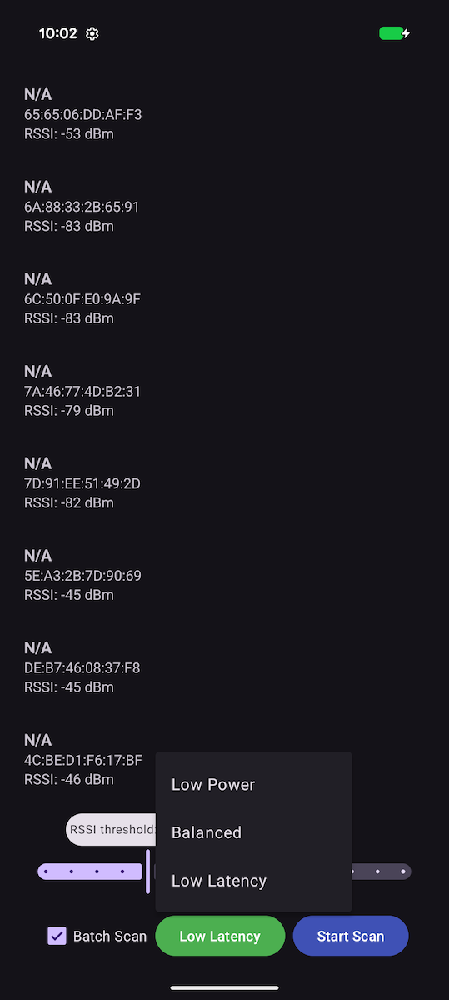

## Bluetooth Scanning App

## Purpose

This application serves as a basic tool for Bluetooth Low Energy (BLE) scanning functionality on Android. It allows users to quickly initiate a scan and view nearby devices along with their signal strength.

## Screenshot



## Features

* **BLE Device Scanning**: Initiates scans for nearby Bluetooth Low Energy devices.
* **Device Discovery List**: Displays found devices with their Name (or MAC Address) and RSSI (Received Signal Strength Indicator).
* **Configurable Scan Settings**:
    * **RSSI Filter**: Filters displayed devices by signal strength using a slider.
    * **Batch Scan**: Gathers scan results in batches.
    * **Scan Mode**: Allows selection between `Low Power`, `Balanced`, and `Low Latency` modes.

## Usage

1.  **Launch & Grant Permissions**: Start the app and grant the required `BLUETOOTH_SCAN` and `ACCESS_FINE_LOCATION` permissions when prompted.
2.  **Configure Scan (Optional)**: Before starting, you can adjust the RSSI filter or change the scan mode to fit your needs.
3.  **Start Scan**: Press the "Start Scan" button. Devices that match your configuration will appear in the list.

> **Note**: You must restart the scan for any configuration changes to take effect.

## Build

1.  **Build the app:**
    ```
    m ScanningApp
    ```
2.  **Install the app:**
    ```
    adb install -r ${ANDROID_PRODUCT_OUT}/system/app/ScanningApp/ScanningApp.apk
    ```
3.  **Launch the app.**
